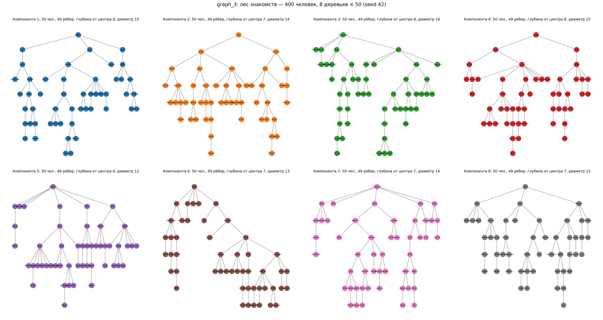

# DATASET: граф знакомств и QA-датасеты graph_3

Полное описание данных: граф, корпус, QA-сплиты, self-study датасеты, гарантии и
команды перегенерации. Промпты и взаимодействие с LLM — в [PROMPTS.md](PROMPTS.md),
дизайн экспериментов — в [PLAN.md](PLAN.md).

---

## 1. Файлы

| Файл | Что это | Размер |
|---|---|---|
| `data/base/forest.json` | граф: люди, рёбра, `_meta` (параметры, статистика) | 27 KB |
| `data/base/corpus.txt` | граф как текст — то, что видит модель / картридж | 13.8 KB |
| `data/base/forest.png` | визуализация 8 деревьев | — |
| `data/base/train_handshake.parquet` | 2045 train-вопросов (Conversation) | 185 KB |
| `data/base/test_handshake.parquet` | 900 test-вопросов | 92 KB |
| `data/base/{train,test}_meta.json` | те же записи плоским JSON (question, answer, path, …) | |
| `data/base/split_meta.json` | параметры сплита + счётчики бакетов | |
| `outputs_graph3/exp{1,2}_*/artifact/dataset.parquet` | self-study трейсы для обучения | 3.6 / 2.5 MB |

## 2. Граф

**Лес из 8 несвязанных компонент × 50 человек = 400 людей, 392 ребра.** Каждая
компонента — дерево ⇒ путь между любыми связанными людьми **единственный** —
и дистанция, и цепочка проверяются детерминированно. Пары из разных компонент —
структурный источник негативов («not connected»).



- Генерация: случайное дерево на компоненту; новый человек прицепляется к
  существующему с весом `(1 + depth)^alpha`, `alpha=1.5` вытягивает деревья в
  глубину (это даёт пары на хопы 7–8). `seed=42` — детерминированно.
- Диаметры компонент: 15, 14, 16, 15, 11, 13, 14, 13 (все ≥ 11 — глубокие пары
  есть в каждой).
- **Имена: все 400 уникальны.** Пул из 463 имён (US имена + фамильные), выборка
  без возвращения; связи случайны под seed → выучить граф из претрейна нельзя,
  имя — однозначный идентификатор узла.

**Пар на каждый хоп (неупорядоченных), вся валидация — при генерации:**

| хоп | 1 | 2 | 3 | 4 | 5 | 6 | 7 | 8 | не связаны |
|---|---|---|---|---|---|---|---|---|---|
| пар | 392 | 662 | 907 | 1139 | 1274 | 1259 | 1228 | 1032 | 345¹ |

¹ для негативов сэмплируется 345 пар из ~60k возможных межкомпонентных.

## 3. Корпус (вход модели / картриджа)

По предложению на ребро, **каждое ребро ровно один раз**, порядок строк
перемешан (чтобы не кодировать структуру компонент порядком):

```
Stephen and Gerald know each other.
Brennan and Morales know each other.
... (392 строки)
```

| | |
|---|---|
| Размер | 13 783 символа = **3145 токенов** (Qwen3-токенизатор) |
| Картридж (сжатие ×5) | **`CARTRIDGE_TOKENS = 629`** |
| Транзитивность в тексте | отсутствует: только хоп-1 факты, всё n≥2 модель обязана вывести |

## 4. QA-датасеты (train / test)

### Вопрос — один шаблон везде

```
How many handshakes apart are {X} and {Y}? If they are not connected, say so.
End your reply with "path: {X} - ... - {Y}" and "Answer: <number>", or
"Answer: not connected".
```

Открытый ответ-число: нет 50%-floor и Yes-bias бинарных вопросов graph_2;
случайное угадывание ≈ 1/9.

### Gold (вычисляется BFS по графу, модель не участвует)

```
path: Janet - Johnston - Hale - Jordan - Schmidt - Murphy - Hudson
Answer: 6
```
```
Answer: not connected
```

### Состав

| хоп | train | test | назначение |
|---|---|---|---|
| 1–6 | по 300 | по 100 | обучаемые глубины |
| 7–8 | **0** | по 100 | holdout: чистая проверка обобщения по глубине |
| not connected | 245 (12%) | 100 | негативы (анти-Yes-bias урок graph_2) |
| **итого** | **2045** | **900** | |

### Правила сплита (без утечек)

1. **Сплит на уровне неупорядоченных пар**: пара {X,Y} попадает либо в train,
   либо в test — ни в каком порядке имён не пересекаются.
2. **Train материализует оба порядка** («X и Y» + «Y и X», отношение
   симметричное), потом бакет обрезается до 300. **Test — один случайный порядок
   на пару** → ровные бакеты по 100.
3. Хопы 7–8 — только test; неиспользованный запас пар (1128 и 932) позволяет
   расширить test или сделать второй сплит без перегенерации графа.
4. Негативные пары train и test не пересекаются.

Поля каждой записи (`*_meta.json` и `metadata` в parquet):
`question, answer ("3"|"not connected"), true_distance (int|null),
n_bucket ("1".."8"|"none"), x, y, path (list|null)`.

## 5. Self-study датасеты (вход обучения картриджей)

Производятся синтезами из train-вопросов; **ровно 1 трейс на вопрос** в обоих
экспериментах → датасеты size-matched (2045 vs 2045), конфаунд «метод × объём»
из graph_2 снят. Схема `Conversation`: пустой system (граф будет в картридже),
user = вопрос, assistant = трейс модели с `token_ids` + **top-20 logprobs**
(KL-дистилляция). Подробности и примеры трейсов — [PROMPTS.md §6](PROMPTS.md).

**Состав ночного прогона (10–11.06, no-think; будет перегенерирован с thinking):**

| | exp1_adaptive | exp2_plain |
|---|---|---|
| трейсов | 2045 | 2045 |
| источник | 260 no_hint + 1785 with_hint | все no_hint |
| верных | 2009 (98.2%) | 261 (12.8%) |
| медиана длины трейса | 205 токенов | 73 токена |
| logprobs | 100% | 100% |

Распределение по хопам наследуется от train (300 на хопы 1–6 + 245 none).
Ошибочные трейсы не выбрасываются — флаг `correct` в metadata (Exp 3 = фильтр
exp2-датасета по этому флагу, без повторного синтеза).

## 6. Гарантии / что провалидировано

- **Gold-пути**: все 2945 записей проверены программно — путь существует, концы
  = (x, y), длина = дистанция, каждая соседняя пара — реальное ребро.
- **Уникальность имён**: 400/400, в рёбрах тот же набор.
- **Парсер ↔ формат**: gold-ответ и программный scratchpad дают 100% acc/fidelity
  при прогоне через `extract_answer`/`extract_path` (юнит + 900 + 60 кейсов).
- **Минимумы пар на хоп** проверяются генератором (`--min-pairs-shallow 160`,
  `--min-pairs-deep 100`); seed 42 прошёл с первого раза.

## 7. Перегенерация

```bash
source examples/graph_3/scripts/env.sh

# 1. Граф + корпус (ручки: --components, --component-size, --alpha, --seed, минимумы пар)
python -m examples.graph_3.data_gen.generate_forest

# 2. QA-сплиты (ручки: --test-per-hop 100, --train-per-hop 300,
#    --train-max-hop 6, --train-nonrel-frac 0.12, --seed 42)
python -m examples.graph_3.data_gen.qagen

# 3. Self-study (нужен Tokasaurus; THINKING=1 по умолчанию)
bash examples/graph_3/scripts/run_exp1_synth.sh
bash examples/graph_3/scripts/run_exp2_synth.sh
```

Всё детерминированно по seed, кроме ответов модели в синтезах (greedy
детерминирован при фиксированном сервере/батчинге, доп. пассы exp2 — temp 0.7).
